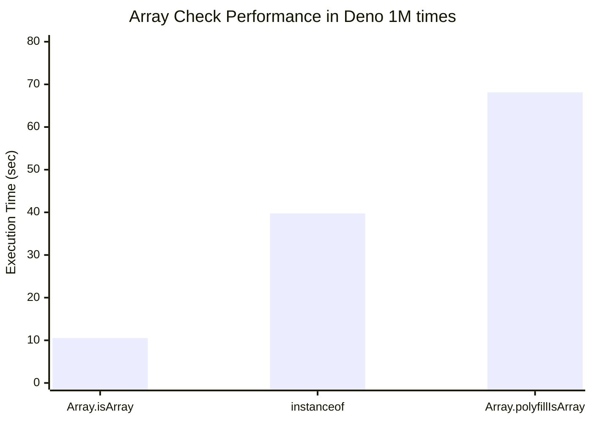
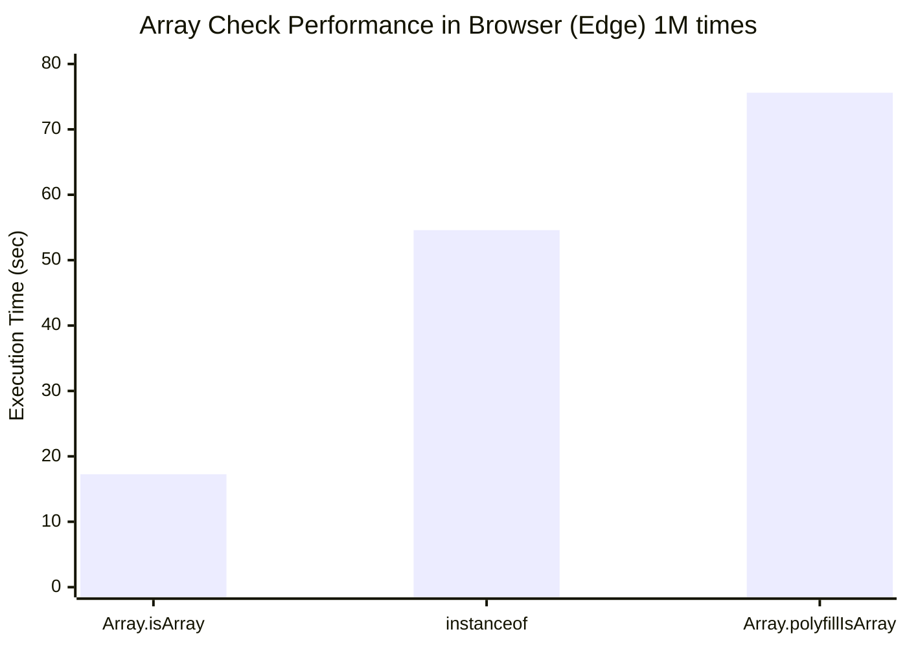

# What is Different `instanceof Array` and `Array.isArray()` Method

## 테스트 코드 실행

테스트 코드는 브라우저, deno 두 가지가 준비 되어 있습니다.

**browser**:

`practice-002.html`을 실행하세요.

**deno**:

```shell
# cd practice-002
deno run ./practice-002.js
```



